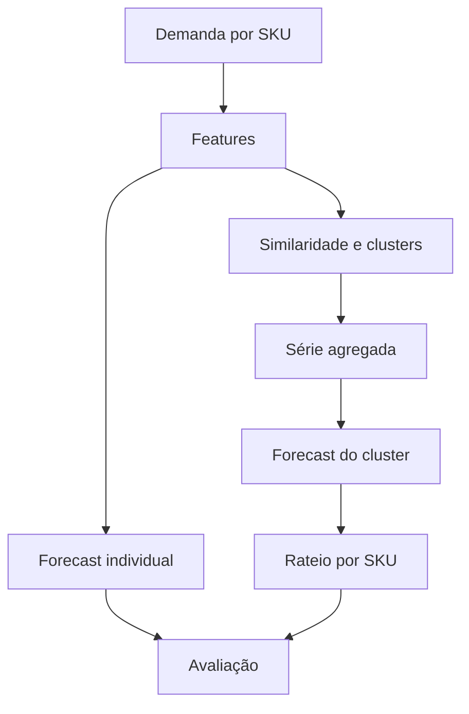

# Forecasting Multi-SKU

[](https://www.python.org/)
[](#modelos)
[](https://fastapi.tiangolo.com/)

Sistema para previsão de demanda de múltiplos produtos, com modelos estatísticos, machine learning e foundation models. Inclui análise de similaridade, clustering de séries, previsão agregada e desagregação proporcional por SKU.

## Visão geral

Prever milhares de séries individualmente pode ser caro e instável, especialmente quando há pouco histórico ou demanda intermitente. Este projeto compara duas estratégias:

1. **Forecast individual:** cada SKU recebe seu próprio pipeline;
2. **Forecast por cluster:** séries semelhantes são agregadas, previstas e posteriormente rateadas.



## Capacidades

- geração de 20 SKUs sintéticos com 2,5 anos de histórico diário;
- cinco arquétipos: estável, sazonal, tendência de alta, tendência de baixa e intermitente;
- variáveis temporais, climáticas, safras, lags e estatísticas móveis;
- similaridade por DTW, Pearson e distância euclidiana;
- clustering hierárquico com seleção de `k` por silhouette score;
- forecast individual e agregado;
- rateio por pesos históricos móveis ou estáticos;
- intervalos de previsão e comparação por múltiplas métricas;
- dashboard interativo para exploração e análise.

## Modelos

| Modelo | Abordagem | Exógenas | Uso recomendado |
|---|---|---:|---|
| XGBoost | Gradient boosting | Sim | relações não lineares |
| LightGBM | Gradient boosting | Sim | treino eficiente |
| Auto ARIMA | Estatístico | Sim | séries regulares |
| Prophet | Decomposição | Sim | tendência e sazonalidade |
| Chronos-Bolt | Foundation model | Não | inferência zero-shot |
| Croston SBA | Intermitente | Não | demanda esporádica |

Todos os modelos implementam uma interface comum com `fit()`, `predict()` e `get_params()`.

## Dados sintéticos

Além da demanda, o gerador inclui temperatura, precipitação, umidade, calendário, estações do hemisfério sul e fases de safra. Os dados são destinados à demonstração; não representam uma operação comercial real.

## Como executar

```bash
git clone https://github.com/viniciusds2020/sistema_multiplos_forecast.git
cd sistema_multiplos_forecast

python -m venv .venv
source .venv/bin/activate  # Linux/macOS
# .venv\Scripts\activate # Windows

pip install -r requirements.txt
python app.py
```

Para executar a demonstração via terminal:

```bash
python sistema_forecast.py
```

> O Chronos-Bolt depende do PyTorch. Se necessário, instale uma distribuição adequada ao seu ambiente antes de instalar `chronos-forecasting`.

## Métricas

| Métrica | Interpretação |
|---|---|
| MAE | erro absoluto médio |
| RMSE | penaliza erros maiores |
| MAPE | erro percentual; requer cuidado com zeros |
| WAPE | erro ponderado, útil em séries intermitentes |
| Bias | identifica sobreprevisão ou subprevisão sistemática |

A comparação deve priorizar validação temporal e métricas compatíveis com o comportamento de cada SKU.

## Estrutura

```text
data/                    # geração e feature engineering
models/                  # modelos e registry
similarity/              # distâncias, clustering e agregação
pipeline/                # pipelines individual e por cluster
evaluation/              # métricas
templates/ e static/     # interface
app.py                   # aplicação
sistema_forecast.py      # demonstração CLI
```

## Dashboard

A interface reúne:

- visão geral e KPIs;
- exploração das séries e variáveis;
- análise de similaridade e clusters;
- previsão individual ou agregada;
- comparação de modelos e resíduos.

## Decisões técnicas

- a interface comum facilita comparar modelos heterogêneos;
- clustering permite compartilhar sinal entre séries semelhantes;
- WAPE e Bias complementam métricas pouco robustas a zeros;
- Croston SBA oferece uma referência específica para demanda intermitente;
- Chronos permite comparar modelos treinados localmente com uma abordagem zero-shot.

## Limitações

- dados e clima são sintéticos;
- resultados não constituem benchmark de produção;
- o rateio proporcional pressupõe estabilidade relativa entre SKUs;
- a escolha de cluster e modelo deve ser revalidada ao longo do tempo;
- operação real requer backtesting automatizado, monitoramento de drift e reconciliação hierárquica.

## Roadmap

- [ ] backtesting rolling-origin;
- [ ] seleção automática de modelo por SKU;
- [ ] reconciliação hierárquica de forecasts;
- [ ] monitoramento de drift e viés;
- [ ] persistência de experimentos e modelos.

## Autor

Desenvolvido por [Vinicius de Sousa](https://github.com/viniciusds2020).
